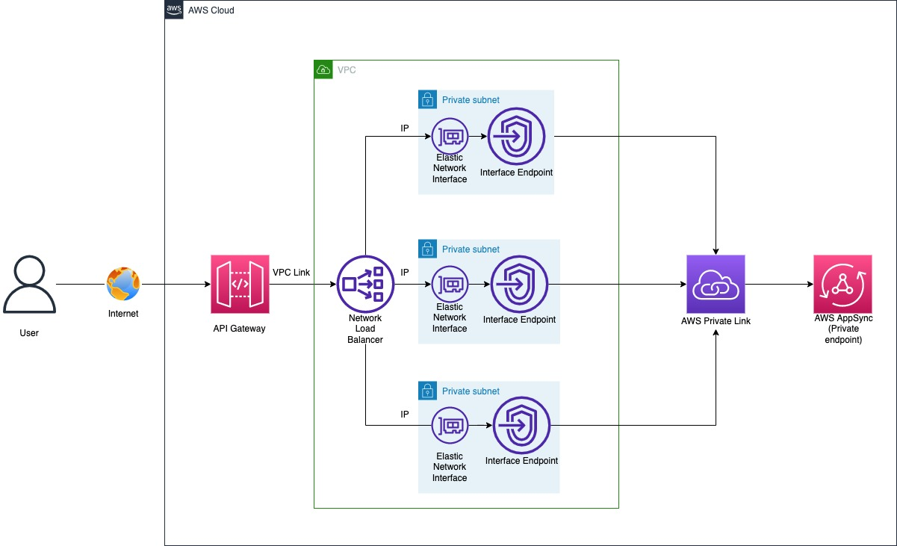

# aws-apigateway-to-appsync-private-endpoint

## Connect your AWS API Gateway to a private AppSync GraphQL endpoint using CDK

This CDK application deploys a private Appsync GraphQL API and integrates with AWS API Gateway for public access from the Internet using Private Link and VPC interface endpoints. In this way you need not expose the GraphQL endpoints directly on the Internet.  


## Architecture that you will be deploying: 



### Architecture Setup

There are two parts to this: 

#### 1. AWS AppSync Private API Setup

- Create an AWS AppSync service with private api endpoint.
- Create an AWS VPC with multiple private Subnets.
- Create a PrivateLink to the AppSync endpoint ((appsync.<aws-region>.amazonaws.com)) and your VPC. To establish a private connection between your VPC and the AWS AppSync service, you must create an [interface VPC endpoint](https://docs.aws.amazon.com/vpc/latest/privatelink/vpce-interface.html). Interface endpoints are powered by AWS [PrivateLink](http://aws.amazon.com/privatelink), which enables you to privately access AWS AppSync APIs without an internet gateway, NAT device, VPN connection, or AWS Direct Connect connection. Instances in your VPC don't need public IP addresses to communicate with AWS AppSync APIs. Traffic between your VPC and AWS AppSync doesn't leave the AWS network.
- An internal NLB is created with Target Group of Target Type "ip" and add the targets IPs obtained from the VPC interface endpoints Elastic Network Interface.

#### 2. A REST API with AWS API Gateway with private integration to Internal NLB setup

- Create a private integration between the API Gateway and the internal Network Load Balancer in your VPC via VPC links. 
- Create an API on API Gateway with a proxy resource connecting to the AppSync private API endpoint.

## How this setup works? 

- A user can access the public facing API Gateway from the Internet
- API Gateway has a resource connected to an Internal Network Load Balancer(NLB) via VPC links
- NLB has a Target Group with Target Type as IP. The IP addresses used here are obtained from the Elastic Network Interfaces(ENIs) associated with the VPC interface Endpoints powered by AWS Private Link for each subnet/AZ created for the AppSync service. 
- NLB routes the traffic to one of the VPC interface endpoints ENI which inturn is sent to the AppSync endpoint(appsync.<aws-region>.amazonaws.com) and then eventually to the private GraphQL API endpoint. 

Note: The authentication set on the AppSync API is ``API Key`` and it expires every 7 days. The best practice is to configure automatic rotation using AWS Secrets Manager or based on your use-case use other methods as described [here](https://docs.aws.amazon.com/appsync/latest/devguide/security-authz.html).

## Deployment Steps

### Prerequisites

- [Create an AWS account](https://portal.aws.amazon.com/gp/aws/developer/registration/index.html) if you do not already have one and log in. The IAM user that you use must have sufficient permissions to make necessary AWS service calls and manage AWS resources.
- [AWS CLI](https://docs.aws.amazon.com/cli/latest/userguide/install-cliv2.html) installed and configured
- [Git Installed](https://git-scm.com/book/en/v2/Getting-Started-Installing-Git)
- [AWS Cloud Development Kit](https://docs.aws.amazon.com/cdk/latest/guide/cli.html) (AWS CDK) installed

The `cdk.json` file tells the CDK Toolkit how to execute your app.

## Instructions

1. Create a new directory, navigate to that directory in a terminal and clone the GitHub repository:
   ```
   git clone https://github.com/aws-samples/aws-apigateway-to-appsync-private-endpoint
   ```
1. Change directory to the pattern directory:
   ```
   cd aws-apigateway-to-appsync-private-endpoint
   ```
1. Install dependencies
   ```
   npm install
   ```
1. From the command line, use AWS SAM to deploy the AWS resources for the pattern as specified in the template.yml file:
   ```
   npx aws-cdk deploy
   ```

## Test the GraphQL Endpoint using the API Gateway URL

1. Login to the AppSync console and get the API key for your private API that you created just now via CDK

1. Login to the AppSync console and get the API Gateway URL that you deployed just now or from the cdk deployment output from the previous step

1. Use the below Curl commands to test from your terminal

   ### Adding new records to DynamoDB

   ```
   curl -v https://<unique-string>.execute-api.<aws-region>.amazonaws.com/prod/graphql \
   -H "Content-Type:application/graphql" \
   -H "x-api-key:<API-KEY>" \
   -d '{"query":"mutation createDemo($createdemoinput: DemoInput!) {\n addDemo(input: $createdemoinput) {\n id\n version\n }\n}","variables":{"createdemoinput":{"version":"test 1"}}}'
   ``` 

   ```
   curl -v https://<unique-string>.execute-api.<aws-region>.amazonaws.com/prod/graphql \
   -H "Content-Type:application/graphql" \
   -H "x-api-key:<API-KEY>" \
   -d '{"query":"mutation createDemo($createdemoinput: DemoInput!) {\n addDemo(input: $createdemoinput) {\n id\n version\n }\n}","variables":{"createdemoinput":{"version":"test 2"}}}'
   ```

   ### Query for the added records from the DynamoDb
   ```
   curl -v https://<unique-string>.execute-api.<aws-region>.amazonaws.com/prod/graphql \
   -H "Content-Type:application/graphql" \
   -H "x-api-key:<API-KEY>" \
   -d '{"query": "query listTodos {listTodos {items {id title description priority}}}","variables":"{}"}'
   ```

   The results should show as below where you can see the versions ``test 1`` and ``test 2`` added in the previous step

   ```
   {"data":{"getDemos":[{"id":"94db1d82-e5d4-4b5b-968a-4965fd4120d5","version":"test 1"},{"id":"504280a7-a4b3-40f6-be46-4268a5440a25","version":"test 2"}]}}%  
   ```

## Clean Up

```
npx aws-cdk destroy --all
```

## Security

See [CONTRIBUTING](CONTRIBUTING.md#security-issue-notifications) for more information.

## License

This library is licensed under the MIT-0 License. See the LICENSE file.

